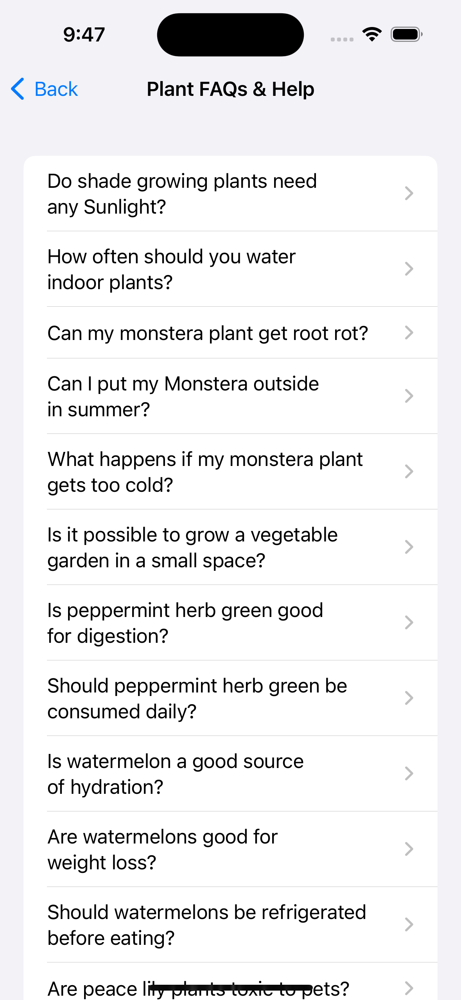

# Plantasium

Plantasium formed out of a need to track when my house plants had last been watered, and to notify me when they needed watering again.

The app is written entirely in native SwiftUI.

## Prerequisites

- Xcode 15.1 or above.
- A valid API key for [Perenual](https://perenual.com/docs/api), stored in a `.env` file at the project root as the `PERENUAL_API_KEY` env var.

### Usage

- When using the app for the first time, 3 example plants will be generated and stored in the data model.
- Select a plant in the main list view to edit it, or add new plants using the `+` button in the top right.
- Delete plants by swiping left on the plant cell from the main list.
- Mark a plant as fed by swiping right in the main list; this will reset the feeding clock according to the plant's feed period.

### Perenual API Integration

- There are various houseplant data APIs that offer plant species data such as images & care instructions.
- I opted to integrate [Perenual](https://perenual.com/docs/api) as the free plan offers a high enough request limit for testing, and also offers some filtering based on indoor plants.
- Currently the first page of FAQs from Perenual can be viewed from the the `?` Help Button in the top left of the main plant list view.
- See the [main file for the API implementation](Plantasium/api/QuestionAPI.swift)

 

 

### Still to come

- Local notifications
- User images
- UI Tests (accessibility labels are not currently specified for existing UI elements, making UI tests for SwiftUI elements unreadable)
- FAQs search
- Plant species search
